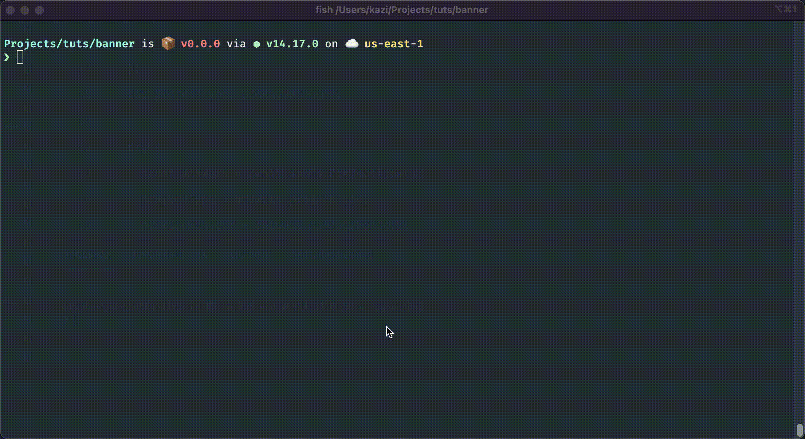

# :unicorn: Vite Pretty Lint


[](https://www.npmjs.com/package/vite-pretty-lint)
[](https://www.npmjs.com/package/vite-pretty-lint)

It is a simple package to initialize Recommended ESLint and Prettier config for Vite Vue & React Projects.

## :fire: How It Works



## :gift: Installation

```sh
// NPM
npx vite-pretty-lint

// YARN
yarn vite-pretty-lint
```

## :microscope: Testing

After Cloning the repository, install all npm dependencies by running: `npm install`.

Then Run Tests:

```bash
$ npm run test
$ npm run coverage
```

## :date: Change log

Please see [release history][link-releases] for more information on what has changed recently.

## :heart: Contributing

Please feel free to contribute ideas and PRs are most welcome.

## :crown: Credits

- [Kazi Mainuddin Ahmed][link-author]
- [All Contributors][link-contributors]

## :policeman: License

The MIT License (MIT). Please see [License File](LICENSE) for more information.

[link-author]: https://github.com/tzsk
[link-contributors]: ../../contributors
[link-releases]: ../../releases
